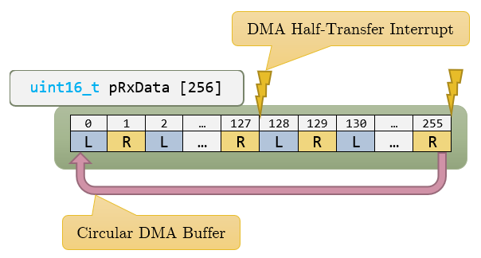
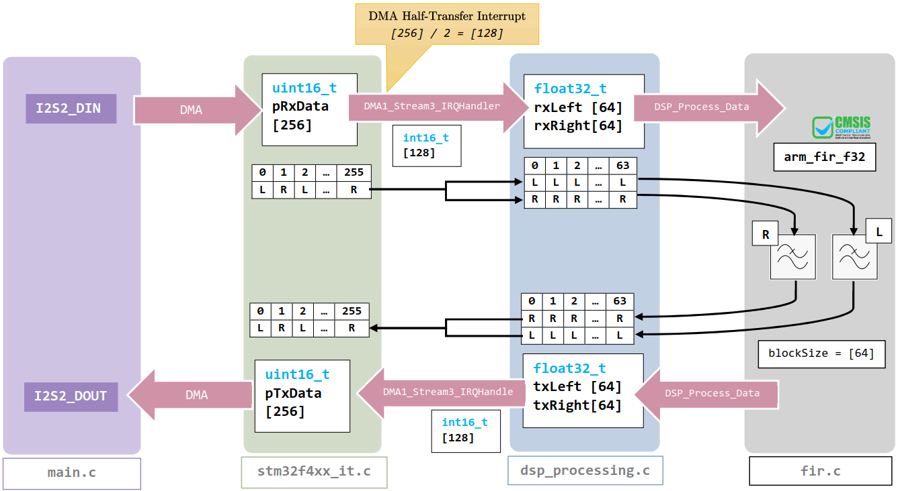

# P5-DSP-Board-mdk
C Firmware for FHNW P5 DSP Board based on STM32F412 / TLV320aic

---

[](https://forthebadge.com)

Demo Software for a custom Hardware.

---

### Abstract

In the area of HAM radio or hobby music a demand exists for an inexpensive and simple audio effect box.
This project aims to develop such an effect box focussing on good performance but at a low cost using the ARM Cortex-M4\texttrademark series processor architecture because it offers floating point digital signal processing (DSP).
In the greater picture the board will be programmable through a user friendly computer software, thereby offering an attractive solution for consumers interessted in a signal processing device.
The device uses an STM32F412 microcontroller with a TLV320 stereo audio codec and features a USB port for power and programming as well as two 1 inch OLED displays, two rotary encoders and two push buttons and is capable of running on a rechargeable battery.
The board allows the manipulation of the audio signal using the CMSIS/DSP library, whereby a simple FIR filter is implemented for demonstration purposes.
As a result of validation measurements, the hardware has a $THD_2$ of 75.77dB and an ENOB of 11.23 bit.

**Keywords**

ARM Cortex-M4}, CMSIS/DSP, Audio Effect Box, Digital Signal Processing


---

### DSP Dataflow



The Data is sampled through I2S2 and stored in a buffer via DMA.



The full data processing workflow is visible above.

---

### How does the DSP Magic work?

See the following files:

- `main.c` DMA Transfer Start
- `stm32f4xx_it.c` for DMA Half Transfer Inpterrupt
- `dsp_processing.c` for implementation of different DSP effects
- `fir.c` for implementation of CMSIS/DSP FIR example


---

### SSD1306 OLED

[mnemocron/stm32-ssd1306](https://github.com/mnemocron/stm32-ssd1306)

[afiskon/stm32-ssd1306](https://github.com/afiskon/stm32-ssd1306)

```c
SSD1306_t holed1;

holed1.hi2cx = &hi2c1;

ssd1306_Init(&holed1);
ssd1306_Fill(&holed1, Black);
ssd1306_SetCursor(&holed1, 2, 0);
ssd1306_WriteString(&holed1, "Hello,", Font_11x18, White);
ssd1306_UpdateScreen(&holed1);

```

---

### License

Copyright (c) 2019 Simon Burkhardt, Mischa Studer

No license applies! You may not reuse the provided code in any form without permission.


